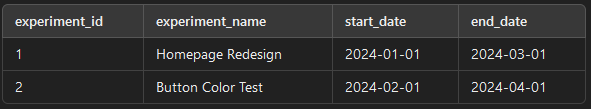
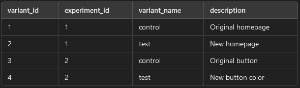
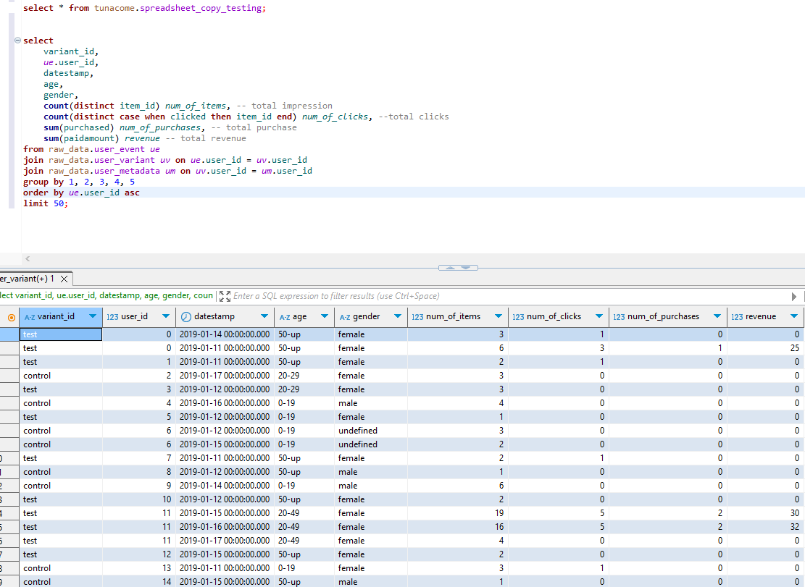
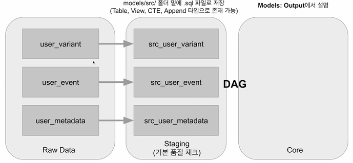

# Best Practice
- Variables, Connections, Secrets management
- Data QC -> cost reduction

# Normalization
- 1NF : 1 cell 1 data
- 2NF : 1NF + PK uniqueness (star schema)
- 3NF : 2NF + transferable dependency removed (a->b->c)

# SCD: Slowly Changing Dimensions
- created at, modified at 같은 것
- Production table (OLTP) <-> DW Table (OLAP)
- 히스토리 유지 관점에서 어떻게 관리?
- SCD Type 0: Fixed values (member join date etc...)
- SCD Type 1: Initially null but updates later (yearly income etc...)
- SCD Type 2: Entity's new record (member tier regular -> vip.. WHEN did it change?) Essentially a history tracking
    - policy: keep two (regular, vip) records with record dates. but as RECORDS, not a dim table.
- SCD Type 3: Entity's new column (member tier columns ++)
- SCD Type 4: In practice. Entity has a separate dimension TABLE for the record, unlike SCD 2.

# DBT use cases
- AB Test: Total sum validation test for group A and group B
    - AND there's an ELT even for that. That's just great.
    
    
    - Or take a look at this
    9
- Experiment = AB Test synonym

# core concepts
- seeds: dimension tables are seeds which only has one column - dbt seeds
- sources: aliases for schemas and tables. sources.yml0
- snapshot: dbt uses SCD 2. If an entity's data changes from the dim table, make a new dim table for history/snapshot
    - ex> an employee's job code changes from a to b -> new table : job code a is valid from x to y -> composite key emp id + valid from + to

# Get started: now would be a good time - dbt core on local
- install: `sudo pip install dbt-redshift` -> core module included
    - dbt init project_name
### configs
- dbt settings are in ~/.dbt/profiles.yml : defines connection and stuff
- project settings are in project/path/dbt_project.yml
### what
- under models folder
- use sql + jinja
- input
    - defines raw and staging, src data
    - raw: cte
    - staging: view
- output
    - core data
    - core: table
### flow
- config
- connector
- tier ((input)model...essentially ELT) cte/ctas/cvas, raw data -> staging(models/src) -> core(models/fact, models/dim)
- test code
- snapshot (as needed)
- example:
    
